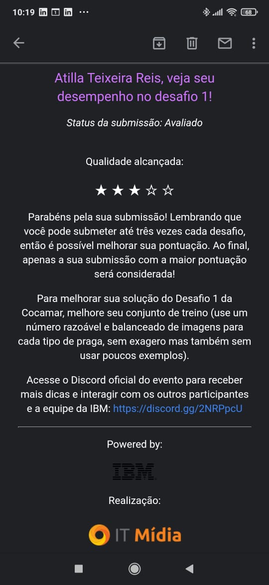

# BTC-IBM-Desafio1-Cocamar

<h1 align="center">
    
</h1>

<h4 align="center">
  🚀 Maratona Behind The Code-IBM
</h4>

 

  <a href="#rocket-tecnologias">Tecnologias</a>&nbsp;&nbsp;&nbsp;|&nbsp;&nbsp;&nbsp;
  <a href="#-projeto">Projeto</a>&nbsp;&nbsp;&nbsp;|&nbsp;&nbsp;&nbsp;
  <a href="#-integração">Integração</a>&nbsp;&nbsp;&nbsp;|&nbsp;&nbsp;&nbsp;
 

 

  

## :rocket: Tecnologias

Esse projeto foi desenvolvido com as seguintes tecnologias:

- [IBM-Cloud Object Storage]
- [Watson Studio]
- [Watson Visula Recognition]

## 💻 Projeto

Sistema automático de identificação das pragas que atingem a lavoura de soja.
Vamos focar somente nas quatro principais pragas que atigem a lavoura de soja, são elas:

1.Lagarta da soja
2.Percevejo marrom
3.Percevejo pequeno
4.Percevejo verde

## 👾 Integração da APi

cURL:

API endpoint

https://gateway.watsonplatform.net/visual-recognition/api

Authentication

curl -u "apikey:{apikey}" "https://gateway.watsonplatform.net/visual-recognition/api/v3/{method}"

Classify an image (GET)

curl -u "apikey:{apikey}" "https://gateway.watsonplatform.net/visual-recognition/api/v3/classify?url=https://watson-developer-cloud.github.io/doc-tutorial-downloads/visual-recognition/fruitbowl.jpg&version=2018-03-19&classifier_ids=Desafio1_256982046"

Classify an image (POST)

curl -X POST -u "apikey:{apikey}" -F "images_file=@fruitbowl.jpg" -F "threshold=0.6" -F "classifier_ids=Desafio1_256982046" "https://gateway.watsonplatform.net/visual-recognition/api/v3/classify?version=2018-03-19"

Java:

Maven

<dependency>
	<groupId>com.ibm.watson.developer_cloud</groupId>
	<artifactId>java-sdk</artifactId>
	<version>6.9.0</version>
</dependency>

Gradle

compile 'com.ibm.watson.developer_cloud:java-sdk:6.9.0'

Authentication

IamOptions options = new IamOptions.Builder()
	.apiKey("{apikey}")
	.build();

VisualRecognition visualRecognition = new VisualRecognition("{version}", options);

Classify an image

IamOptions options = new IamOptions.Builder()
	.apiKey("{apikey}")
	.build();

VisualRecognition service = new VisualRecognition("2018-03-19", options);

InputStream imagesStream = new FileInputStream("./fruitbowl.jpg");
ClassifyOptions classifyOptions = new ClassifyOptions.Builder()
	.imagesFile(imagesStream)
	.imagesFilename("fruitbowl.jpg")
	.threshold((float) 0.6)
	.classifierIds(Arrays.asList("Desafio1_256982046"))
	.build();

ClassifiedImages result = service.classify(classifyOptions).execute();
System.out.println(result);

Node:

npm

npm install --save watson-developer-cloud

Authentication

var VisualRecognitionV3 = require('watson-developer-cloud/visual-recognition/v3');

var visualRecognition = new VisualRecognitionV3({
	version: '{version}',
	iam_apikey: '{apikey}'
});

Classify an image

var VisualRecognitionV3 = require('watson-developer-cloud/visual-recognition/v3');
var fs = require('fs');

var visualRecognition = new VisualRecognitionV3({
	version: '2018-03-19',
	iam_apikey: '{iam_api_key}'
});

var images_file= fs.createReadStream('./fruitbowl.jpg');
var classifier_ids = ["Desafio1_256982046"];
var threshold = 0.6;

var params = {
	images_file: images_file,
	classifier_ids: classifier_ids,
	threshold: threshold
};

visualRecognition.classify(params, function(err, response) {
	if (err) { 
		console.log(err);
	} else {
		console.log(JSON.stringify(response, null, 2))
	}
});

Python:

pip

pip install --upgrade "watson-developer-cloud>=2.4.1"

Authentication

from watson_developer_cloud import VisualRecognitionV3

visual_recognition = VisualRecognitionV3(
    version='{version}',
    iam_apikey='{apikey}'
)

Classify an image

import json
from watson_developer_cloud import VisualRecognitionV3

visual_recognition = VisualRecognitionV3(
    '2018-03-19',
    iam_apikey='{iam_api_key}')

with open('./fruitbowl.jpg', 'rb') as images_file:
    classes = visual_recognition.classify(
        images_file,
        threshold='0.6',
	classifier_ids='Desafio1_256982046').get_result()
print(json.dumps(classes, indent=2))

Ruby:

Installation

gem install ibm_watson

Authentication

require "ibm_watson"

visual_recognition = IBMWatson::VisualRecognitionV3.new(
  version: "{version}",
  iam_apikey: "{apikey}"
)

Classify an image

require "json"
require "ibm_watson/visual_recognition_v3"
include IBMWatson

visual_recognition = VisualRecognitionV3.new(
  version: "2018-03-19",
  iam_apikey: "{iam_api_key}"
)

File.open("./fruitbowl.jpg") do |images_file|
  classes = visual_recognition.classify(
    images_file: images_file,
    threshold: "0.6",
    classifier_ids: ["Desafio1_256982046"]
  )
  puts JSON.pretty_generate(classes.result)
end
---

Feito com ♥ em na maratona Behind The Code 2020 da IBM

